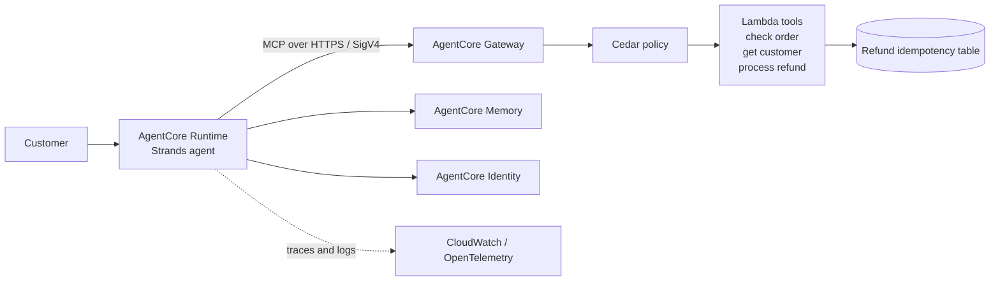

# Production-Like Customer Support Agent

An Amazon Bedrock AgentCore customer support agent built with **Strands**. It runs on AgentCore Runtime, calls business tools through an MCP Gateway, uses AgentCore Memory for cross-session recall, and applies IAM, Cedar authorization, retries, idempotency, and OpenTelemetry observability.

## Architecture



## Business capabilities

- `check_order`: returns order status, delivery information, and delay reasons.
- `get_customer`: retrieves a customer profile.
- `process_refund`: validates and processes refunds with exponential-backoff retries and an idempotency guard.
- Memory recalls user preferences across separate sessions.
- Cedar allows refunds up to `$1,000` and denies larger refunds at the gateway, including prompt-injection attempts.
- Runtime-to-gateway requests use AWS IAM and SigV4. Secrets are stored outside the repository in AgentCore Identity or local ignored environment files.

The handlers include deterministic failure triggers for timeout, HTTP 500, invalid parameters, and transient refund failures. These produce traceable failure scenarios without requiring external test data. See [docs/evidence.md](docs/evidence.md) for commands and observability evidence.

## Validation

```bash
agentcore validate

python3 -m venv .venv-test
source .venv-test/bin/activate
pip install -r requirements-dev.txt
pytest tests/ -v
```

Deployment is performed with `agentcore deploy`. The deployed scenarios cover order lookup, customer lookup, memory across sessions, successful and denied refunds, prompt-injection protection, retry safety, and failure tracing.

## Project layout

- [app/CustomerSupportAgent](app/CustomerSupportAgent): Strands runtime agent and MCP client.
- [tools](tools): Lambda business tools.
- [agentcore/agentcore.json](agentcore/agentcore.json): AgentCore resources and policies.
- [agentcore/cdk](agentcore/cdk): CDK infrastructure and least-privilege IAM.
- [tests](tests): Handler and reliability tests.
- [docs/testing.md](docs/testing.md): Detailed local, deployment, scenario, and failure testing commands.
- [docs/evidence.md](docs/evidence.md): Required scenario and observability evidence.
- [Screenshots.docx](Screenshots.docx): Screenshots of key scenarios and results.

No credentials or secrets are committed to this repository. `.gitignore` files are included where needed to exclude local credentials, generated artifacts, and development environments.
